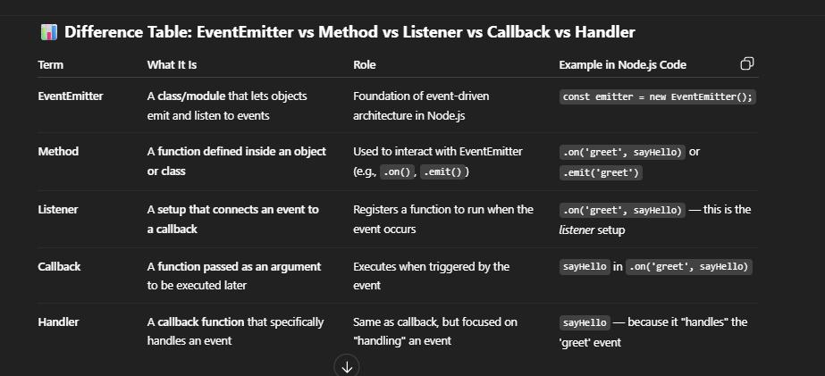

# Event Driven Architecture of Node.js

- there are three main players in event driven architecture.

- EVENT EMITTER ------emits event -->EVENT LISTNER--------call event handler---> EVENT HANDLER;

1. Event emitter is responsible for emit the event

2. Event lister listens the event emitted by emitter and fire up the callback function attach to that event'

3. The callback function know as event handler

## example of event emitter

- http , fs, net , process , stream , req(data,end,error,close)

- The .on() method is not the listener itself — it's the method we use to attach or register a listener (a callback function) to a specific event name.

- .on()-> Adds a listener that triggers every time the event is emitted

# Single Threaded

- Node.js is single-threaded in the sense that it uses a single main thread to execute JavaScript code — especially the event loop.

# libuv

- in node runtime v8 & libuv exists

- multi-platform support library for Node.js

- Handles asynchronous i/o operations

- event driven architecture provide

- manage file system , netwroking , timer non-blocking across platform

- libuv is a C library used by Node.js to provide asynchronous I/O operations by using a thread pool, event loop, and system-level APIs like networking, file system access, and timers.

- It’s the engine under Node.js that lets JavaScript — which is single-threaded — do many things in the background.

# Event Loop

- The event loop is a mechanism that allows JavaScript (which is single-threaded) to execute non-blocking, asynchronous operations — by coordinating the call stack, task queues, and background APIs like file I/O, timers, or HTTP.
